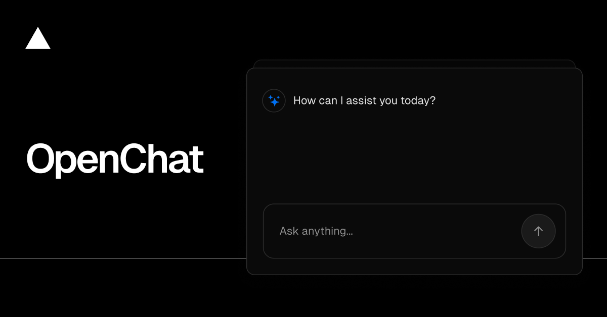

<a href="https://chat.vercel.ai/">
  
  <h1 align="center">Chat SDK</h1>
</a>

<p align="center">
    Chat SDK is a free, open-source template built with Next.js and the AI SDK that helps you quickly build powerful chatbot applications.
</p>

<p align="center">
  <a href="https://chat-sdk.dev"><strong>Read Docs</strong></a> ·
  <a href="#features"><strong>Features</strong></a> ·
  <a href="#model-providers"><strong>Model Providers</strong></a> ·
  <a href="#deploy-your-own"><strong>Deploy Your Own</strong></a> ·
  <a href="#running-locally"><strong>Running locally</strong></a>
</p>
<br/>

## Features

- [Next.js](https://nextjs.org) App Router
  - Advanced routing for seamless navigation and performance
  - React Server Components (RSCs) and Server Actions for server-side rendering and increased performance
- [AI SDK](https://ai-sdk.dev/docs/introduction)
  - Unified API for generating text, structured objects, and tool calls with LLMs
  - Hooks for building dynamic chat and generative user interfaces
  - Supports xAI (default), OpenAI, Fireworks, and other model providers
- [shadcn/ui](https://ui.shadcn.com)
  - Styling with [Tailwind CSS](https://tailwindcss.com)
  - Component primitives from [Radix UI](https://radix-ui.com) for accessibility and flexibility
- Data Persistence
  - [Neon Serverless Postgres](https://vercel.com/marketplace/neon) for saving chat history and user data
  - [Vercel Blob](https://vercel.com/storage/blob) for efficient file storage
- [Auth.js](https://authjs.dev)
  - Simple and secure authentication

## Model Providers

This template supports two ways to call LLMs:

- **Gateway mode (default)**: uses the [Vercel AI Gateway](https://vercel.com/docs/ai-gateway) (billed via your Vercel account).
- **Direct mode**: uses your **own provider API key(s)** (e.g. OpenAI/Anthropic/Google).

You can switch modes with the `AI_PROVIDER_MODE` environment variable (see `.env.example`).

### Gateway mode (AI Gateway)

**For Vercel deployments**: Authentication is handled automatically via OIDC tokens.

**For non-Vercel deployments**: You need to provide an AI Gateway API key by setting the `AI_GATEWAY_API_KEY` environment variable in your `.env.local` file.

### Direct mode (bring your own API key)

1. Set `AI_PROVIDER_MODE=direct`
2. Set the provider key(s) you want to use:
   - `OPENAI_API_KEY`
   - `ANTHROPIC_API_KEY`
   - `GOOGLE_GENERATIVE_AI_API_KEY`
3. In the UI, select a model that matches the provider key you configured (e.g. `openai/*` if you set `OPENAI_API_KEY`).

Optional: set `AI_DEFAULT_MODEL`, `AI_TITLE_MODEL`, and `AI_ARTIFACT_MODEL` (format: `provider/model`) to control which models are used for non-chat tasks like titles and artifacts.

Optional: set `AI_DIFY_MODEL` (format: `provider/model`) to fix which model is used for `/dify` DSL generation.

## Deploy Your Own

You can deploy your own version of the Next.js AI Chatbot to Vercel with one click:

[](https://vercel.com/templates/next.js/nextjs-ai-chatbot)

## Running locally

You will need to use the environment variables [defined in `.env.example`](.env.example) to run Next.js AI Chatbot. It's recommended you use [Vercel Environment Variables](https://vercel.com/docs/projects/environment-variables) for this, but a `.env` file is all that is necessary.

> Note: You should not commit your `.env` file or it will expose secrets that will allow others to control access to your various AI and authentication provider accounts.

1. Install Vercel CLI: `npm i -g vercel`
2. Link local instance with Vercel and GitHub accounts (creates `.vercel` directory): `vercel link`
3. Download your environment variables: `vercel env pull`

```bash
pnpm install
pnpm db:migrate # Setup database or apply latest database changes
pnpm dev
```

Your app template should now be running on [localhost:3000](http://localhost:3000).
