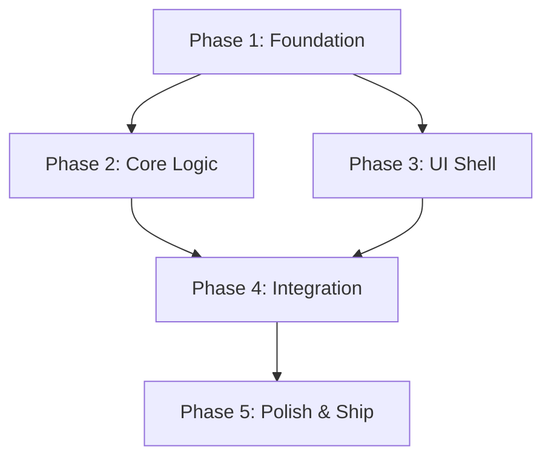

# Draft Implementation Plan

## Core Intent

Break a PRD+TRD into ordered, budgeted implementation phases with explicit
dependency graphs and parallel execution opportunities. For plans with 3+
phases, automatically triggers plan-mode gating requiring user approval.

## Prerequisites

- PRD must exist
- TRD recommended (provides technical constraints and architecture)
- Cardinal rules extracted (engineering + deploy domains)

## Implementation Plan Structure

| # | Section | Description |
|---|---------|-------------|
| 1 | Overview | 1-paragraph summary of what we're building |
| 2 | Phase Breakdown | Ordered list of phases, each with: name, goal, turn budget, deliverables |
| 3 | Dependency Graph | Mermaid graph showing which phases block others |
| 4 | Parallel Groups | Phases that can execute simultaneously |
| 5 | Critical Path | Longest chain of dependent phases |
| 6 | Risk Register | Implementation risks with mitigations |
| 7 | Success Criteria | Per-phase measurable completion conditions |
| 8 | Resource Requirements | Tools, APIs, agents, environments needed |
| 9 | Annotation Plan | What gets annotated at each phase |
| 10 | Rollback Plan | How to unwind if a phase fails |

## Action Catalog

### Phase Planning (4 actions)

| # | Action | Description |
|---|--------|-------------|
| 1 | `plan.break_down` | Break scope into ordered implementation phases |
| 2 | `plan.allocate_budget` | Assign turn budgets to each phase |
| 3 | `plan.identify_parallel` | Find phases that can run concurrently |
| 4 | `plan.critical_path` | Calculate critical path through phase graph |

### Dependency Analysis (3 actions)

| 5 | `plan.dependency_graph` | Generate Mermaid dependency graph |
| 6 | `plan.detect_cycles` | Check for circular dependencies |
| 7 | `plan.optimize_order` | Reorder phases for maximum parallelism |

### Output (3 actions)

| 8 | `plan.generate_document` | Generate full implementation plan document |
| 9 | `plan.trigger_plan_mode` | If phases >= 3, trigger plan-mode proposal |
| 10 | `plan.save` | Save to jarvis/prd/ via save-to-cortex |

## Procedure

1. Load PRD + TRD (both must exist)
2. Extract cardinal rules that constrain implementation
3. Break scope into phases — each phase is a coherent deliverable
4. Assign turn budgets per phase based on complexity and risk
5. Build dependency graph — which phases block which?
6. Identify parallel groups — which phases can run simultaneously?
7. Calculate critical path — the longest chain of dependent phases
8. If phases >= 3: trigger plan-mode (render proposal, await approval)
9. Generate full implementation plan document
10. Save to jarvis/prd/{title}-IMPL-PLAN-{date}.md
11. Annotate completion with phase count, total budget, parallel groups

## Phase Budgeting Guidelines

| Complexity | Turn Budget | Example |
|-----------|-------------|---------|
| Trivial | 50-100 | Single file edit, config change |
| Simple | 100-200 | New component, small feature |
| Moderate | 200-400 | New page, API endpoint, medium feature |
| Complex | 400-800 | Multi-file feature, integration |
| Major | 800-1600 | New domain, architecture change |
| Epic | 1600+ | Multi-domain, cross-system |

## Anti-Patterns

- DON'T create implementation plans without a PRD — no scope = no plan
- DON'T skip dependency analysis — hidden dependencies cause cascading failures
- DON'T forget to trigger plan mode for 3+ phase plans
- DON'T overallocate budget — leave 20% buffer for unexpected issues
- DON'T create circular dependencies — the dependency graph must be a DAG

## Dependency Graph Example

In this example: P1 blocks everything, P2 and P3 can run in parallel after P1,
P4 requires both P2 and P3, P5 is the final phase.

## Related Workflows

- `playbooks/planning-research/workflows/implementation-plan.yaml` — full impl plan pipeline
- `playbooks/planning-research/workflows/plan-mode-propose.yaml` — approval gate
