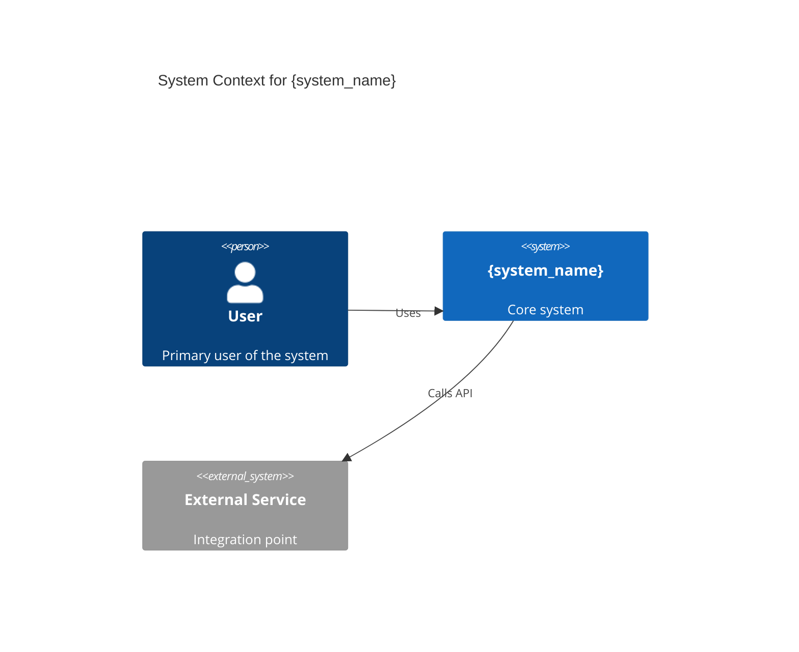
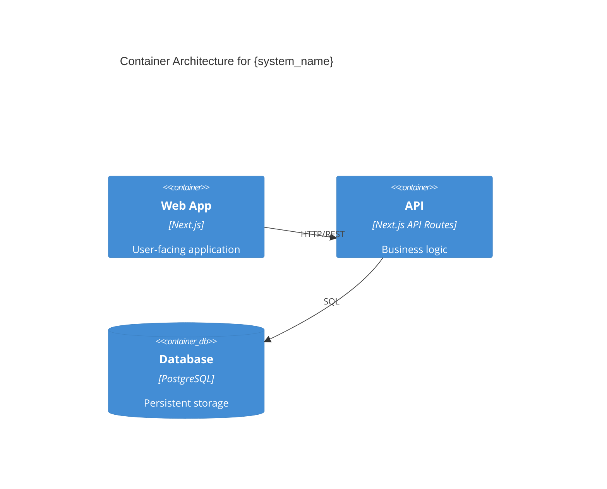
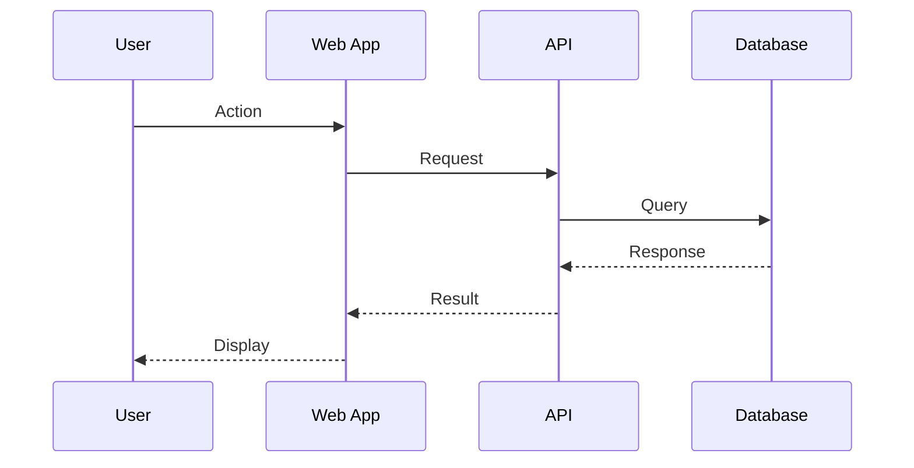

# Draft TRD — Technical Requirements Document

## Core Intent

Translate a PRD into a concrete, implementable technical specification.
Includes Mermaid architecture diagrams (C4 model), OpenAPI 3.0 API contracts,
database schema definitions, and deployment architecture decisions.

## Prerequisites

- A completed PRD must exist at jarvis/prd/
- The PRD provides scope, functional requirements, and success criteria
- Cardinal rules (especially engineering + deploy domains) must be extracted

## TRD Sections

| # | Section | Description |
|---|---------|-------------|
| 1 | Architecture Overview | C4 Context diagram showing system + external dependencies |
| 2 | Container Architecture | C4 Container diagram showing services, databases, queues |
| 3 | Component Design | Key components, their responsibilities, and interactions |
| 4 | Data Model | Entity definitions, relationships, database schema changes |
| 5 | API Contracts | OpenAPI 3.0 specifications for all endpoints |
| 6 | Sequence Diagrams | Key flows: authentication, core business logic, error handling |
| 7 | Deployment Architecture | Target infrastructure, scaling strategy, environment config |
| 8 | Security Design | Auth model, data protection, threat mitigations |
| 9 | Migration Strategy | Data migration plan, backwards compatibility, rollback |
| 10 | Performance Budget | Latency targets, throughput requirements, resource limits |
| 11 | Monitoring & Observability | Metrics, logs, alerts, health checks |
| 12 | Open Questions | Unresolved technical decisions with options + trade-offs |

## Action Catalog

### Diagram Generation (4 actions)

| # | Action | Description |
|---|--------|-------------|
| 1 | `trd.generate_c4_context` | Generate Mermaid C4 Context diagram |
| 2 | `trd.generate_c4_container` | Generate Mermaid C4 Container diagram |
| 3 | `trd.generate_sequence` | Generate sequence diagram for a specific flow |
| 4 | `trd.generate_deployment` | Generate deployment architecture diagram |

### API & Data (3 actions)

| 5 | `trd.generate_openapi` | Generate OpenAPI 3.0 specification from requirements |
| 6 | `trd.generate_data_model` | Generate entity definitions and relationships |
| 7 | `trd.generate_migration_plan` | Generate data migration strategy |

### Document Assembly (3 actions)

| 8 | `trd.assemble` | Combine all sections into complete TRD |
| 9 | `trd.validate` | Check all sections present, diagrams valid, contracts complete |
| 10 | `trd.save` | Save to jarvis/prd/ via save-to-cortex |

## Procedure

1. Load the PRD via viewFile (must exist first)
2. Extract cardinal rules (engineering + deploy domains)
3. Run deep-research on technical approach if needed
4. Generate C4 context diagram showing system boundaries
5. Generate C4 container diagram showing internal services
6. Generate OpenAPI 3.0 contracts for each endpoint group
7. Generate data model with entity definitions
8. Generate sequence diagrams for 3-5 key flows
9. Generate deployment architecture diagram
10. Assemble all sections into complete TRD document
11. Validate completeness and cardinal rule compliance
12. Save to jarvis/prd/{title}-TRD-{date}.md
13. Annotate completion

## Anti-Patterns

- DON'T write a TRD without a PRD — the PRD defines scope
- DON'T skip C4 diagrams — visual architecture is mandatory
- DON'T write vague API contracts — use OpenAPI 3.0 with full schemas
- DON'T skip the deployment section — every TRD must specify how it runs
- DON'T leave open questions unresolved — flag them explicitly with options

## Mermaid Diagram Templates

### C4 Context

### C4 Container

### Sequence Diagram

## Related Workflows

- `playbooks/planning-research/workflows/tech-design-doc.yaml` — full TRD pipeline
