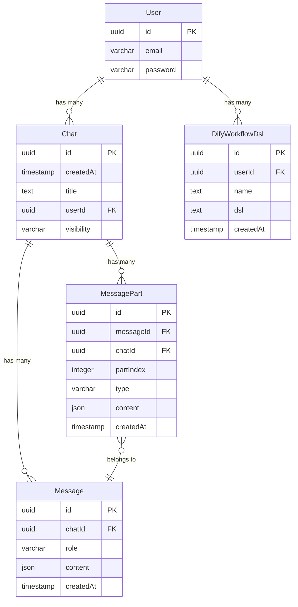
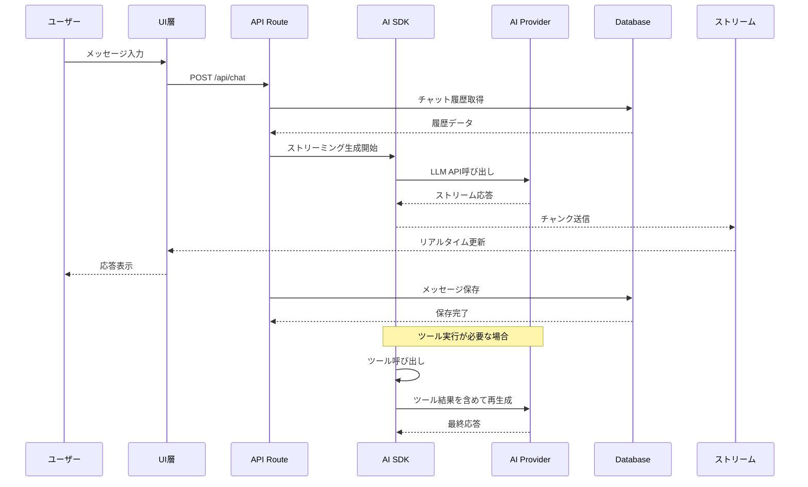
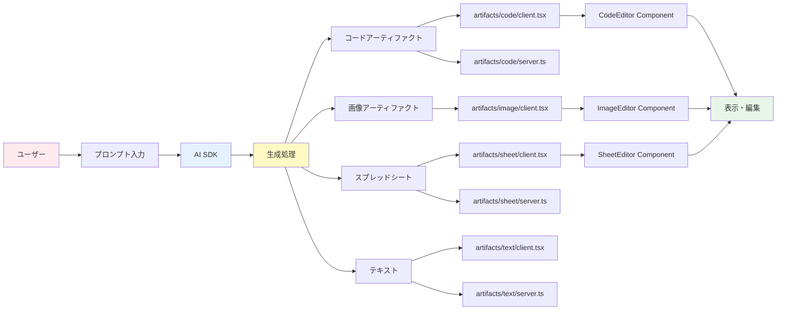
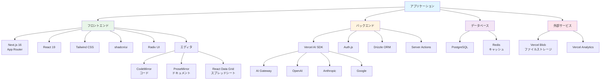
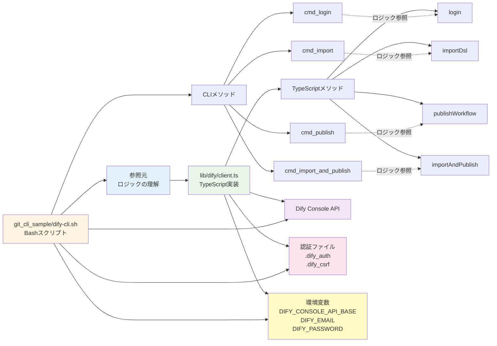
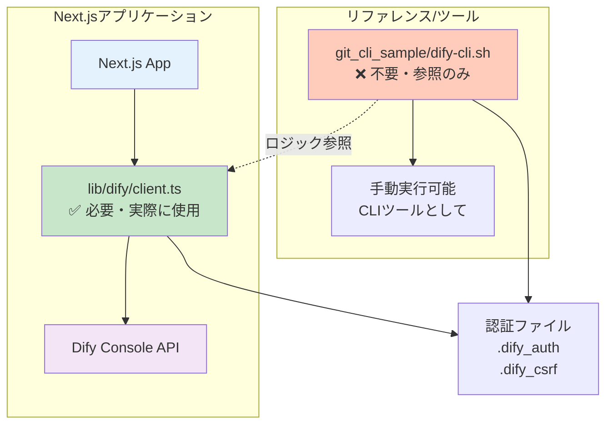

# プロジェクト構造図

## 1. ディレクトリ構造図

```mermaid
graph TD
    ROOT[ai-chatbot/] --> APP[app/]
    ROOT --> COMPONENTS[components/]
    ROOT --> LIB[lib/]
    ROOT --> HOOKS[hooks/]
    ROOT --> ARTIFACTS[artifacts/]
    ROOT --> TESTS[tests/]
    ROOT --> CONFIG[設定ファイル]
    
    APP --> AUTH[\(auth\)/]
    APP --> CHAT[\(chat\)/]
    APP --> DIFY_APP[dify/]
    APP --> LAYOUT[layout.tsx]
    APP --> GLOBALS[globals.css]
    
    AUTH --> AUTH_API[api/auth/]
    AUTH --> AUTH_PAGES[login/, register/]
    AUTH --> AUTH_CONFIG[auth.ts, auth.config.ts]
    
    CHAT --> CHAT_PAGES[page.tsx, chat/\[id\]/]
    CHAT --> CHAT_API[api/chat/, api/files/, api/history/]
    CHAT --> CHAT_LAYOUT[layout.tsx]
    
    COMPONENTS --> UI[ui/]
    COMPONENTS --> AI_ELEMENTS[ai-elements/]
    COMPONENTS --> ELEMENTS[elements/]
    COMPONENTS --> MAIN[chat.tsx, messages.tsx, etc.]
    
    LIB --> AI[ai/]
    LIB --> DB[db/]
    LIB --> DIFY_LIB[dify/]
    LIB --> EDITOR[editor/]
    LIB --> UTILS[utils.ts, types.ts]
    
    AI --> MODELS[models.ts]
    AI --> PROVIDERS[providers.ts]
    AI --> TOOLS[tools/]
    
    DB --> SCHEMA[schema.ts]
    DB --> MIGRATIONS[migrations/]
    DB --> QUERIES[queries.ts]
    
    ARTIFACTS --> CODE[code/]
    ARTIFACTS --> IMAGE[image/]
    ARTIFACTS --> SHEET[sheet/]
    ARTIFACTS --> TEXT[text/]
    
    HOOKS --> MSG_HOOK[use-messages.tsx]
    HOOKS --> ART_HOOK[use-artifact.ts]
    HOOKS --> OTHER_HOOKS[その他のフック]
    
    CONFIG --> PKG[package.json]
    CONFIG --> TS[tsconfig.json]
    CONFIG --> NEXT[next.config.ts]
    CONFIG --> DRIZZLE[drizzle.config.ts]
    
    style ROOT fill:#e1f5ff
    style APP fill:#fff4e1
    style COMPONENTS fill:#e8f5e9
    style LIB fill:#f3e5f5
    style ARTIFACTS fill:#fce4ec
    style HOOKS fill:#e0f2f1
```

## 2. アーキテクチャ・データフロー図

```mermaid
graph LR
    USER[ユーザー] --> UI[UI層]
    
    UI --> CHAT_PAGE[app/\(chat\)/page.tsx]
    UI --> CHAT_COMP[components/chat.tsx]
    UI --> MSG_COMP[components/messages.tsx]
    
    CHAT_PAGE --> API_ROUTE[app/api/chat/route.ts]
    CHAT_COMP --> HOOKS[hooks/use-messages.tsx]
    
    API_ROUTE --> AI_SDK[lib/ai/]
    API_ROUTE --> DB_QUERIES[lib/db/queries.ts]
    
    AI_SDK --> MODELS[models.ts]
    AI_SDK --> PROVIDERS[providers.ts]
    AI_SDK --> TOOLS[tools/]
    
    MODELS --> GATEWAY[Vercel AI Gateway]
    MODELS --> DIRECT[Direct Providers]
    
    PROVIDERS --> OPENAI[OpenAI]
    PROVIDERS --> ANTHROPIC[Anthropic]
    PROVIDERS --> GOOGLE[Google]
    
    DB_QUERIES --> DRIZZLE[Drizzle ORM]
    DRIZZLE --> POSTGRES[(PostgreSQL)]
    
    API_ROUTE --> STREAM[ストリーミング応答]
    STREAM --> UI
    
    CHAT_COMP --> ARTIFACTS[artifacts/]
    ARTIFACTS --> CODE_ART[code/]
    ARTIFACTS --> IMAGE_ART[image/]
    ARTIFACTS --> SHEET_ART[sheet/]
    
    UI --> AUTH[app/\(auth\)/auth.ts]
    AUTH --> SESSION[Session管理]
    
    style USER fill:#ffebee
    style UI fill:#e3f2fd
    style API_ROUTE fill:#fff9c4
    style AI_SDK fill:#f1f8e9
    style POSTGRES fill:#e8eaf6
    style STREAM fill:#fff3e0
```

## 3. コンポーネント階層図

```mermaid
graph TD
    ROOT_LAYOUT[app/layout.tsx<br/>RootLayout] --> CHAT_LAYOUT[app/\(chat\)/layout.tsx<br/>ChatLayout]
    
    CHAT_LAYOUT --> SIDEBAR_PROVIDER[SidebarProvider]
    CHAT_LAYOUT --> DATA_STREAM[DataStreamProvider]
    
    SIDEBAR_PROVIDER --> APP_SIDEBAR[AppSidebar]
    SIDEBAR_PROVIDER --> SIDEBAR_INSET[SidebarInset]
    
    APP_SIDEBAR --> SIDEBAR_HISTORY[SidebarHistory]
    APP_SIDEBAR --> USER_NAV[SidebarUserNav]
    
    SIDEBAR_INSET --> CHAT_PAGE[app/\(chat\)/page.tsx]
    CHAT_PAGE --> CHAT_COMP[Chat Component]
    
    CHAT_COMP --> CHAT_HEADER[ChatHeader]
    CHAT_COMP --> MESSAGES[Messages Component]
    CHAT_COMP --> MULTIMODAL_INPUT[MultimodalInput]
    
    MESSAGES --> MESSAGE[Message Component]
    MESSAGE --> AI_ELEMENTS[AI Elements]
    
    AI_ELEMENTS --> MSG_ELEM[Message Element]
    AI_ELEMENTS --> REASONING[Reasoning Element]
    AI_ELEMENTS --> TOOL[Tool Element]
    AI_ELEMENTS --> ARTIFACT[Artifact Element]
    
    ARTIFACT --> CODE_EDITOR[CodeEditor]
    ARTIFACT --> DOCUMENT[Document Editor]
    ARTIFACT --> IMAGE_EDITOR[ImageEditor]
    ARTIFACT --> SHEET_EDITOR[SheetEditor]
    
    MULTIMODAL_INPUT --> PROMPT_INPUT[PromptInput]
    MULTIMODAL_INPUT --> FILE_UPLOAD[File Upload]
    
    CHAT_COMP --> SUGGESTIONS[Suggestions]
    CHAT_COMP --> TOOLBAR[Toolbar]
    
    style ROOT_LAYOUT fill:#e1f5ff
    style CHAT_LAYOUT fill:#fff4e1
    style CHAT_COMP fill:#e8f5e9
    style AI_ELEMENTS fill:#f3e5f5
    style ARTIFACT fill:#fce4ec
```

## 4. データベーススキーマ図



## 5. AI処理フロー図



## 6. 認証フロー図

```mermaid
graph TD
    USER[ユーザー] --> LOGIN[app/\(auth\)/login/page.tsx]
    USER --> REGISTER[app/\(auth\)/register/page.tsx]
    
    LOGIN --> AUTH_FORM[AuthForm Component]
    REGISTER --> AUTH_FORM
    
    AUTH_FORM --> AUTH_ACTIONS[app/\(auth\)/actions.ts]
    AUTH_ACTIONS --> AUTH_API[app/api/auth/...nextauth/route.ts]
    
    AUTH_API --> AUTH_CONFIG[auth.ts]
    AUTH_CONFIG --> SESSION[Session管理]
    
    SESSION --> PROTECTED[保護されたページ]
    PROTECTED --> CHAT_PAGE[チャットページ]
    
    CHAT_PAGE --> USER_NAV[SidebarUserNav]
    USER_NAV --> SIGN_OUT[SignOutForm]
    SIGN_OUT --> AUTH_API
    
    style USER fill:#ffebee
    style AUTH_API fill:#e3f2fd
    style SESSION fill:#fff9c4
    style PROTECTED fill:#e8f5e9
```

## 7. アーティファクト生成フロー図



## 8. 技術スタック図



## 図の見方

- **緑色**: UI/コンポーネント関連
- **黄色**: API/バックエンド処理
- **青色**: ルート/設定
- **紫色**: データベース/ライブラリ
- **ピンク色**: アーティファクト/特殊機能

これらの図は、プロジェクトの構造と関係性を視覚的に理解するのに役立ちます。

## 9. Dify CLI と TypeScript クライアントの関係図



### 関係性の説明

- **参照関係**: `client.ts`は`dify-cli.sh`のロジックを**参照して理解**し、TypeScriptで再実装
- **実行関係**: `dify-cli.sh`は**実行されていない**（独立したCLIツールとして存在）
- **実装の必要性**: 
  - ✅ `client.ts`: Next.jsアプリで**必要**（実際に使用される）
  - ❌ `dify-cli.sh`: Next.jsアプリからは**不要**（リファレンス/手動実行用）
- **共通リソース**: 
  - 同じ認証ファイル（`.dify_auth`, `.dify_csrf`）を使用
  - 同じ環境変数を使用
  - 同じAPIエンドポイントを呼び出し
- **実装の違い**:
  - `dify-cli.sh`: Bash + curl + jq（コマンドライン実行用）
  - `client.ts`: TypeScript + fetch API（Next.jsアプリ内で実行）

### `dify-cli.sh`が存在する理由

1. **リファレンス/ドキュメント**: TypeScript実装のロジックを理解するための参照元
2. **独立したCLIツール**: 手動でコマンドラインから実行する場合に使用可能
3. **検証・デバッグ**: ロジックの動作確認やトラブルシューティング用
4. **開発時の参考**: 新しい機能を追加する際の実装例として参照

### 実装の対応関係

| dify-cli.sh | client.ts | 説明 |
|------------|-----------|------|
| `cmd_login()` | `login()` | Difyにログインして認証トークンを取得 |
| `cmd_import()` | `importDsl()` | DSLファイルをインポート |
| `cmd_publish()` | `publishWorkflow()` | ワークフローを公開 |
| `cmd_import_and_publish()` | `importAndPublish()` | インポートと公開を一括実行 |
| `get_publish_url()` | `getPublishUrl()` | 公開URLを取得 |
| `ensure_login()` | `ensureAuth()` | 認証の確認と必要時のログイン |

## 10. 実装の必要性と役割の違い



### まとめ

**質問への回答**: はい、その通りです。

- ✅ `dify-cli.sh`は**実装の必要がない**（Next.jsアプリからは実行されない）
- ✅ このシェルスクリプトを**ベースにTypeScriptで実装**している
- ✅ `dify-cli.sh`は**リファレンス/ドキュメント**として存在

**実際の動作**:
1. `client.ts`がNext.jsアプリ内で実行される
2. `dify-cli.sh`は手動で実行する場合のみ使用（オプション）
3. 両者は同じ認証ファイルと環境変数を共有するため、互換性がある

